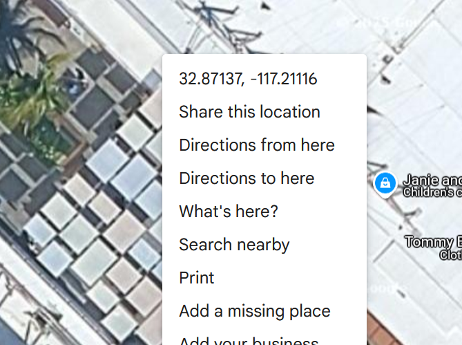

## Sky (Complete Solve)

**Objective:**  
Identify geographic coordinates of a given image and pass them to a Python script.

**Steps:**  
1. **Reverse Image Search:**  
   - Google lens → matched to UTC mall.
  

2. **Visual Verification:**  
   - Used Google Maps Satellite View → matched ceiling and palm trees.

3. **Extract Coordinates:**  
   - Right-click → `What’s here?` → got: `32.87137, -117.21116`

4. **Submit:**  
   - Input the coordinates — passed script check and retrieved flag.

**Tools:**  
| Tool          | Purpose |
|------         |---------|
| Google Images | Reverse search |
| Google Maps   | Satellite match |

**Result:**  
Found exact spot, verified, got the flag.
